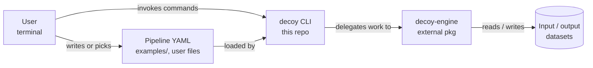

# Architecture

## What this system does

`decoy` is a Typer-based CLI for data masking and synthetic data
generation. It's a thin frontend over the `decoy-engine` library: users
describe a pipeline in YAML, the CLI parses and validates it, and the
engine does the actual data transformation. This repo contains only the
CLI surface, terminal UI, bundled templates, and end-to-end tests; the
engine lives in a separate package (`decoy-engine`).

## System context



## Module map

Inside `src/decoy/`:

| Module | Responsibility |
|---|---|
| `__main__.py` | Typer app assembly. Imports each command and wires it onto the root `app`. |
| `cli/` | One file per command (`run`, `validate`, `init`, `demo`, `explain`, `info`, `storm`, `forecast`, `templates`). Each module owns argument parsing and delegates to the engine. |
| `ui/` | Rich-based output primitives (banner, card, table, progress, theme). No business logic. |
| `templates/` | Bundled starter YAML pipelines surfaced via `decoy templates`. |

## Generated diagrams

Auto-generated from the source by `scripts/build_docs.py`. Regenerate after
significant structural changes; the script is idempotent.

- [`diagrams/deps.svg`](diagrams/deps.svg) — module dependency graph (pydeps).
- [`diagrams/classes_decoy.svg`](diagrams/classes_decoy.svg) — class diagram (pyreverse).
- [`diagrams/packages_decoy.svg`](diagrams/packages_decoy.svg) — package layout (pyreverse).

```bash
pip install pydeps pylint        # one-time; graphviz `dot` must also be on PATH
python scripts/build_docs.py
```

## Where to start reading

1. `src/decoy/__main__.py` — entry point; shows every registered command.
2. `src/decoy/cli/run.py` — the canonical command shape; other commands follow it.
3. `pyproject.toml` — the `decoy = "decoy.__main__:app"` script binding and the engine dependency.
4. `examples/` — real YAML pipelines that exercise the engine end-to-end.

## Sibling maps

- [`decoy-engine/docs/architecture.md`](https://github.com/louiskeep/decoy-engine/blob/main/docs/architecture.md) — domain components (transforms, pipeline graph, generators). The CLI's only meaningful runtime dependency.
- [`decoy-platform/docs/architecture.md`](https://github.com/louiskeep/decoy-platform/blob/main/docs/architecture.md) — system containers, deployment topology, cross-repo workflows.
