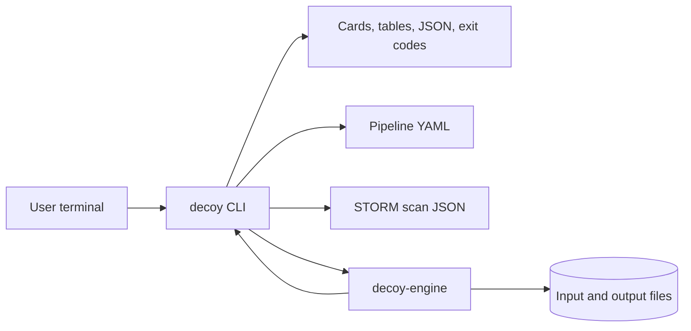
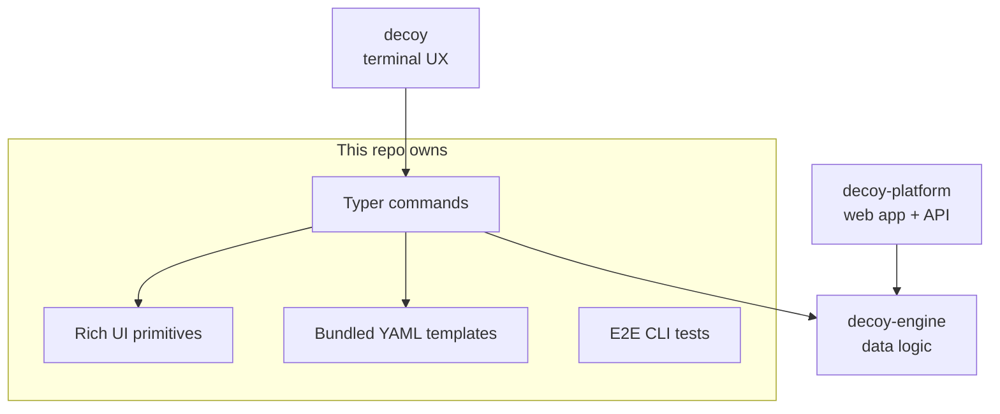
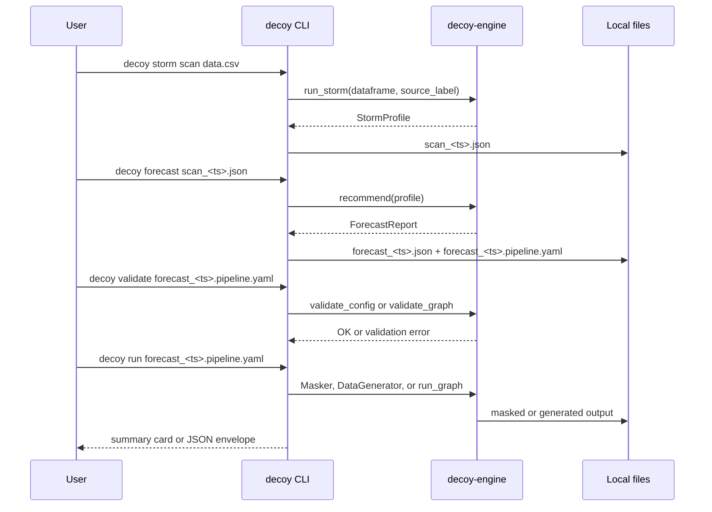
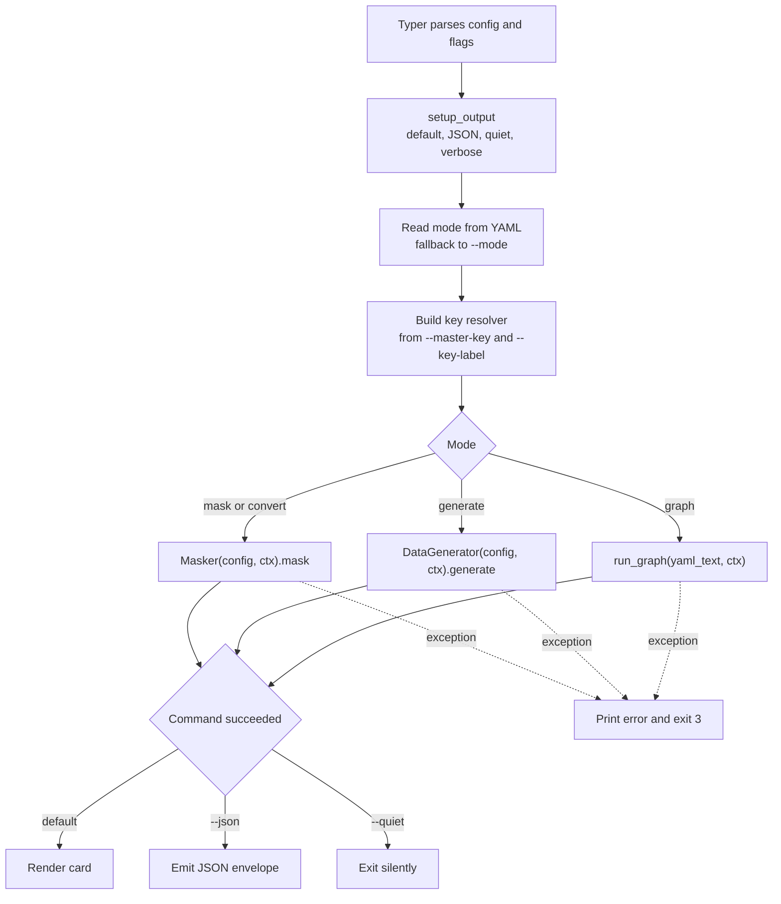
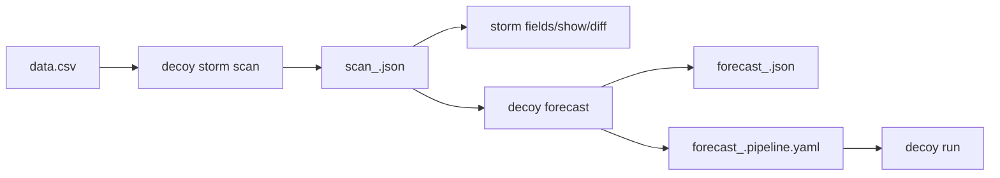
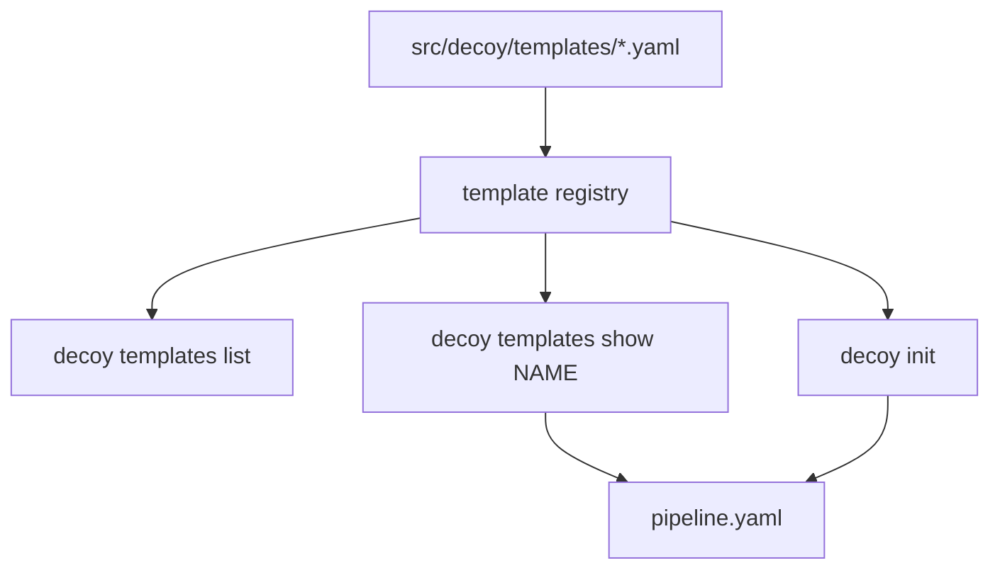

# Product Flow

This guide is the first read for developers who are new to the Decoy CLI. It
explains what this repo owns, how a command moves from terminal input to
`decoy-engine`, and how the command set fits together. It assumes you can read
Python and YAML. It does not assume you already know data masking or the Decoy
product vocabulary.

## What The CLI Does

`decoy` is the terminal product. It is intentionally thin: commands parse user
intent, set up output mode, call `decoy-engine`, and render a human or machine
readable result. The CLI does not implement masking transforms, synthetic data
generation, STORM profiling, FORECAST recommendation logic, graph execution, or
connectors. Those live in `decoy-engine`.

The CLI owns:

- The installed command: `decoy`.
- Typer command registration and help text.
- Rich terminal UX: banners, cards, tables, progress, themes, and hints.
- Bundled starter YAML templates.
- Local demos and examples.
- End-to-end tests that exercise the command surface like a user would.



## Vocabulary

| Term | Simple meaning |
|---|---|
| Command | A Typer command the user invokes, such as `decoy run` or `decoy storm scan`. |
| Pipeline YAML | The config file passed to `decoy validate` and `decoy run`. |
| Template | A bundled starter YAML surfaced by `decoy templates list/show` and `decoy init`. |
| Mode | The engine execution style: `mask`, `generate`, `convert`, or `graph`. |
| STORM scan | A JSON profile produced by `decoy storm scan`. |
| FORECAST report | A JSON recommendation report produced by `decoy forecast`. |
| Output mode | The CLI stdout/stderr behavior: default, `--json`, `--quiet`, or `--verbose`. |
| Chrome | Human-facing progress, cards, hints, and errors. Structured data remains stdout in `--json`. |
| Master key | Optional 32-byte hex key passed to `decoy run` for portable deterministic masking. |

## Where The CLI Sits

The CLI and the platform share the same engine. The difference is product
shape. The CLI is a one-shot tool: it reads files, runs work, writes files, and
exits. The platform is a session product: canvas editing, saved jobs, users,
RBAC, schedules, and dashboards.



Use this rule of thumb:

- Change command syntax, help text, output mode, terminal UX, templates, or CLI
  examples here.
- Change masking behavior, graph ops, STORM, FORECAST, detectors, Disguises,
  or connectors in `decoy-engine`.
- Change persisted jobs, users, schedules, the pipeline canvas, or reports in
  `decoy-platform`.

## The User Journey

The happiest path is:

1. Start with a demo, template, or init scaffold.
2. Scan a real dataset with STORM.
3. Run FORECAST on the scan JSON.
4. Validate the drafted or edited pipeline YAML.
5. Run the pipeline.
6. Inspect output files and iterate.



The minimal command sequence:

```bash
decoy storm scan data.csv
decoy forecast scan_20260514T120000.json
decoy validate forecast_20260514T120015.pipeline.yaml
decoy run forecast_20260514T120015.pipeline.yaml
```

For first contact with no data:

```bash
decoy demo
decoy demo --ref
```

For a scaffold-first flow:

```bash
decoy templates list
decoy templates show hipaa > pipeline.yaml
decoy validate pipeline.yaml
decoy run pipeline.yaml
```

## Command Map

| Command | What it does | Engine call |
|---|---|---|
| `decoy run <pipeline.yaml>` | Execute mask, generate, convert, or graph YAML. | `Masker(...).mask()`, `DataGenerator(...).generate()`, or `run_graph(...)` |
| `decoy validate <pipeline.yaml>` | Check YAML before execution. | `validate_config(...)` or `validate_graph(...)` |
| `decoy init` | Scaffold a starter YAML, optionally interactive. | None for execution; reads CLI bundled templates. |
| `decoy demo` | Run a local scan -> forecast -> mask walkthrough. | `run_storm(...)`, `recommend(...)`, `Masker(...).mask()` |
| `decoy storm scan <data.csv>` | Profile a CSV and save a STORM JSON file. | `run_storm(...)` |
| `decoy storm fields <scan.json>` | List scan fields with PII buckets and QI membership. | None; reads saved scan JSON. |
| `decoy storm show <scan.json> <field>` | Show one field from a saved scan. | None; reads saved scan JSON. |
| `decoy storm diff <old.json> <new.json>` | Compare two scans for schema, PII, and risk drift. | None; reads saved scan JSON. |
| `decoy storm test` | Preview STORM animation without reading data. | None. |
| `decoy forecast <scan.json>` | Recommend Disguises and draft pipeline YAML. | `recommend(...)` |
| `decoy templates list/show` | Browse bundled pipeline templates. | None. |
| `decoy explain <topic>` | Print concept help. | None. |
| `decoy info` | Print banner and quick start hints. | None. |

## What Happens Inside `decoy run`

`decoy run` is the canonical command shape. Other execution commands follow
the same pattern.



The CLI creates an `ExecutionContext` and passes the key resolver when one is
available. It does not currently pass a Rich logger into the engine from
`decoy run`; the engine uses its own logging configuration from YAML unless a
command explicitly provides more context.

Example flat masking run:

```bash
decoy validate examples/mask_example.yaml
decoy run examples/mask_example.yaml
```

Example graph run:

```bash
decoy validate examples/graph_example.yaml
decoy run examples/graph_example.yaml
```

Example JSON mode for scripts:

```bash
decoy run pipeline.yaml --json
```

The JSON result is an envelope, not the masked dataset:

```json
{
  "command": "run",
  "status": "ok",
  "config": "pipeline.yaml",
  "mode": "mask",
  "elapsed_s": 1.234
}
```

## Pipeline Modes

`decoy run` detects a top-level `mode:` key from YAML. The `--mode` flag remains
as a compatibility fallback for old YAML that does not declare mode.

| Mode | When to use | Engine path |
|---|---|---|
| `mask` | Transform an existing dataset according to `masking_rules`. | `Masker(...).mask()` |
| `generate` | Create synthetic tables from a generator config. | `DataGenerator(...).generate()` |
| `convert` | Use the masking pipeline path for format conversion style configs. | `Masker(...).mask()` |
| `graph` | Run a DAG of source, transform, analysis, and target nodes. | `run_graph(...)` |

Masking YAML has `input`, `output`, `mappings`, and `masking_rules`.
Generation YAML has `generator_settings` and `tables`. Graph YAML has `nodes`
and `edges`.

## STORM And FORECAST From The CLI

The CLI makes STORM and FORECAST usable without the platform.



`decoy storm scan` reads raw CSV data and writes a saved profile. Commands like
`storm fields`, `storm show`, and `storm diff` read the saved JSON profile,
not the raw dataset.

`decoy forecast` reads a saved scan and writes two artifacts when not in
stdout mode:

- `forecast_<timestamp>.json`: the full `ForecastReport`.
- `forecast_<timestamp>.pipeline.yaml`: the proposed pipeline from the report.

FORECAST never reads the raw CSV. That boundary is enforced by the engine;
the CLI simply loads the profile JSON and reconstructs the `StormProfile`
dataclass before calling `recommend(...)`.

## Templates And Init

Templates are packaged inside `src/decoy/templates/` and loaded through
`importlib.resources`, so they work from a wheel as well as from source.



`decoy templates show <name>` prints raw YAML by default so shell redirection is
clean:

```bash
decoy templates show minimal > pipeline.yaml
```

`decoy init` uses the same templates. In default mode it may prompt. In
`--json` or `--quiet`, it stays non-interactive and writes a default scaffold.

## Output Modes

Every command should call `setup_output(json_, quiet, verbose)` near the top and
write through the returned `OutputState`.

| Mode | User flag | stdout | stderr |
|---|---|---|---|
| Default | none | Rich cards, tables, or raw YAML for `templates show` | Progress and errors |
| JSON | `--json` | One JSON object or raw report payload, depending on command contract | Progress and errors |
| Quiet | `--quiet` | Nothing on success | Errors only |
| Verbose | `--verbose` | Same as default | Adds stack traces/debug detail |

Rules of thumb:

- `--json` and `--quiet` are mutually exclusive.
- `--quiet` and `--verbose` are mutually exclusive.
- Errors go to stderr.
- Rich rendering is command chrome; machine-readable output should be explicit.
- `NO_COLOR=1` disables ANSI styling through the shared console factory.

## Keyed Deterministic Masking

`decoy run` can build a key resolver for the engine.

```bash
python -c "import secrets; print(secrets.token_hex(32))"
decoy run pipeline.yaml --master-key <64-char-hex> --key-label customers_q4
```

The master key can also come from `DECOY_MASTER_KEY`, and the label can come
from the YAML top-level `key_label:` field.

```yaml
mode: mask
key_label: customers_q4
```

The CLI validates that the master key decodes to exactly 32 bytes. If a master
key is provided without a label, the command fails early with a recovery hint.

## Exit Codes And Errors

Current command behavior is simple:

| Situation | Exit code |
|---|---|
| Success | `0` |
| Invalid config in `decoy validate` | `1` |
| User-facing input errors such as unknown templates/topics | `1` |
| Runtime execution failure in `run`, `storm scan`, `forecast`, or `demo` | `3` |

Errors should say what failed and what the user can try next. The pattern is:

```text
error: what went wrong
  hint: concrete next command or fix
```

In JSON mode, commands emit a structured error envelope instead.

## How To Add A Command

Use this workflow:

1. Add `src/decoy/cli/<name>.py`.
2. Give the command the standard flags: `--json`, `--quiet`, `--verbose`.
3. Call `setup_output(...)` first.
4. Validate CLI-only arguments before calling the engine.
5. Delegate data work to `decoy-engine`.
6. Render default output with `render_card`, `make_table`, or raw stdout when
   the command is intentionally pipeable.
7. Emit one JSON object in `--json` mode.
8. Add a command epilog with realistic examples and a `See also:` line.
9. Register it in `src/decoy/__main__.py`.
10. Add e2e tests under `tests/e2e/`.
11. Update `README.md`, this guide, and `CLI_UX_GUIDE.md` if the command adds
    a new concept or output pattern.

For command groups, create a `typer.Typer(...)` object in the module and use
`app.add_typer(...)` in `__main__.py`.

## Reading Map

After this guide, read in this order:

1. [Architecture](architecture.md) for the module map.
2. [CLI UX Guide](../CLI_UX_GUIDE.md) for output, naming, help, errors, and
   product boundaries.
3. [Pipeline Graph](../PIPELINE_GRAPH_GUIDE.md) for graph-mode CLI behavior.
4. `src/decoy/__main__.py` for command registration.
5. `src/decoy/cli/run.py` for the canonical command implementation pattern.
6. `tests/e2e/` for behavior examples and contracts.

## Debugging Checklist

When a CLI flow behaves oddly, ask:

- Did Typer reject the invocation before our command body ran?
- Did `setup_output` reject an incompatible flag combination?
- Did `decoy run` read `mode:` from YAML, or fall back to `--mode`?
- Did `validate` choose `validate_graph` or `validate_config`?
- Is the issue in CLI argument/output handling, or did the engine raise?
- In `--json` mode, is stdout valid JSON and are errors on stderr?
- Did a docs or hint string use the real command name?
- Does the corresponding e2e test invoke the command the same way a user does?

That boundary keeps this repo focused: the CLI translates terminal intent into
engine calls and good local artifacts. The engine owns the data behavior.
